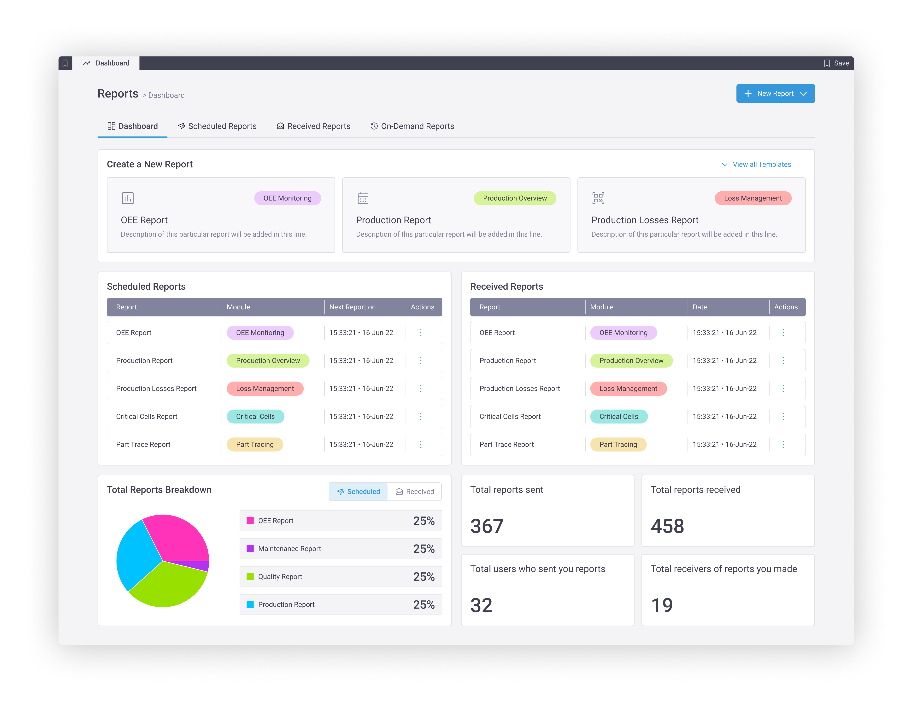

# 🚥 Machine monitoring

## Overview

The machine monitoring module provides real-time visibility into machine-level performance and enables state-based prioritization. It provides you with a comprehensive view of all machines on your line with their real-time status. &#x20;

You can also view machine-level details and understand individual machine performance. &#x20;

You can access the machine monitoring module from the main menu. &#x20;

<figure><figcaption></figcaption></figure>

You will be displayed all machines of your line in a real-time view on the landing page of the machine monitoring module. This view represents the real-time status of your machines if they are cycling, down or idle.&#x20;

<figure><figcaption></figcaption></figure>

You can view details of a machine for a specific period in the machine overview screen. For each machine, you will be displayed its:&#x20;

* Overall OEE and production&#x20;
* Availability, Performance and Quality KPIs&#x20;

On the same screen, you can change the time duration to view machine performance for a different period.&#x20;

<figure><figcaption></figcaption></figure>

You can view all parameters of a machine by navigating to the parameters section. You can either opt to view the parameters in a table form or a graph form.&#x20;

On this screen, you will also be able to drill down to view aggregate downtimes and aggregate cycles of a machine. &#x20;

<figure><figcaption></figcaption></figure>

<figure><figcaption></figcaption></figure>

You can also navigate to the heatmap view of cells and machines from the heatmap tab of the machine monitoring module. This will redirect you to the existing heatmap which will open in a new browser tab. &#x20;

## Heatmap

To access a heatmap view of your line's OEE and APQ parameters, navigate to the "Heatmap" tab of the machine monitoring module. This will open the heatmap in a new browser tab. By default, the heatmap displays all machines on your line along with their OEE values - including average, minimum, and maximum metrics. You can toggle between viewing data by machine(asset) or by cell.


Additionally, you can switch the heatmap to display various performance parameters and apply filters by part types or shifts.

<figure><figcaption></figcaption></figure>

You can filter the heatmap by various parameters to view their values during the selected date range:\
Available Parameters\

1. OEE
2. Availability
   1. Overall Availability
   2. JPH Availability Loss
   3. Availability Part Loss
   4. Downtime
3. Performance
   1. Total Performance
   2. Self-Performance
   3. Good Part JPH
   4. Total Part JPH
   5. Good Parts
   6. Total Parts
4. Quality
   1. Overall Quality
   2. Bad Part JPH
   3. Bad Parts\

You can either view the heatmap of all machines or cells of your line. By default, you will be displayed the heatmap of your machines. \
\
**Machine heatmap view**\
When viewing the machine-level heatmap, you’ll see a list of all machines on your line, each showing:

* The selected parameter’s values for the specified date range
* Machine-specific average, minimum, and maximum values for that parameter

<figure><figcaption></figcaption></figure>

Selecting a machine provides a detailed view of:

1. Production losses related to availability, performance, and quality
2. Key metrics: Availability, Performance, and Quality
3. Additional insights: Downtime details, Cycle details, and Opportunity analysis

<figure><figcaption></figcaption></figure>

**Cell heatmap view**\
When switching to cell-level heatmap view, you’ll see all cells on your line with:

* Selected parameter values for the chosen date range
* Cell-specific average, minimum, and maximum values

<figure><figcaption></figcaption></figure>

Upon selecting a cell, detailed insights include:

1. Production losses due to availability, performance, and quality issues
2. Metrics for Availability, Performance, and Quality
3. Further analysis: Gross downtimes, Interaction history, and Opportunities

<figure><figcaption></figcaption></figure>

## Heatmap drilldowns

The heatmap of cells and machines provides you with a starting point to understand which machines or cells of your line are underperforming in what areas (such as availability, performance, quality, etc).

You can perform the following drilldowns from the heatmap to identify root causes and take appropriate preventive and corrective measures:

1. View gross downtimes and causes of all machines of a cell
2. View downtime details of a specific machine and sub-assemblies
3. View IO level transitions
4. View cell interactions
5. View cycle details of a machine and sub-assemblies
6. Compare two cycles of the same machine or sub-assembly

**Gross downtimes**&#x20;

You can view the downtimes of all machines of a cell from the cell-level heatmap by clicking on the "Gross downtimes" button after selecting a cell.

<figure><figcaption></figcaption></figure>

You will be redirected to the gross downtime screen that highlights:

1. The total wait diagram of the machines of a cell - this diagram represents the line flow of machines within the selected cell. You can select one or more machines from this diagram to view their individual and total downtimes.&#x20;
2. A non-production interval graph that highlights downtime instances by count and by duration of machines within the selected cell.&#x20;
3. List of selected machines (from the total wait diagram) of the selected cell in a tabular format. Each machine tab contains the following details:
   1. Name of the machine
   2. List of downtime causes, ranked by either duration or count
   3. Downtime causes trend of either count or duration

<figure><figcaption></figcaption></figure>

You can further focus on one particular machine's downtime details by clicking the "Downtime details" button from the gross downtimes screen. Additionally, you will be able to download PDFs, images and excel sheets of the non-production interval and downtime causes trend graphs by clicking on their respective download buttons.

**Downtime details**
\
You can view the downtime details of a machine and its sub-assemblies (if they exist) by clicking on the "Downtime details" button after selecting a machine in the machine heatmap.

