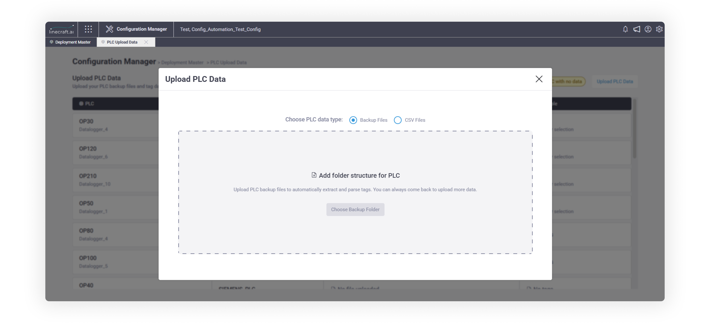
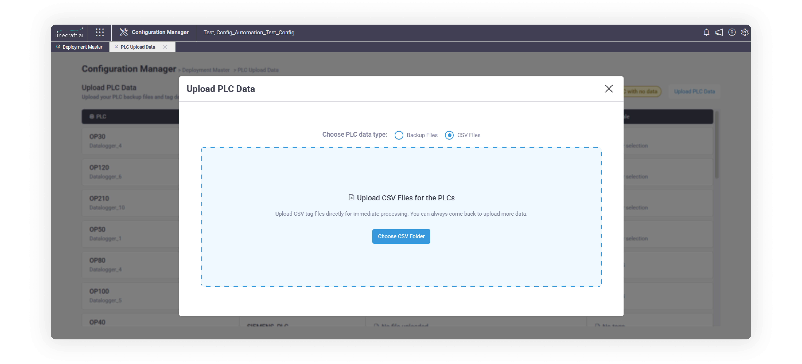
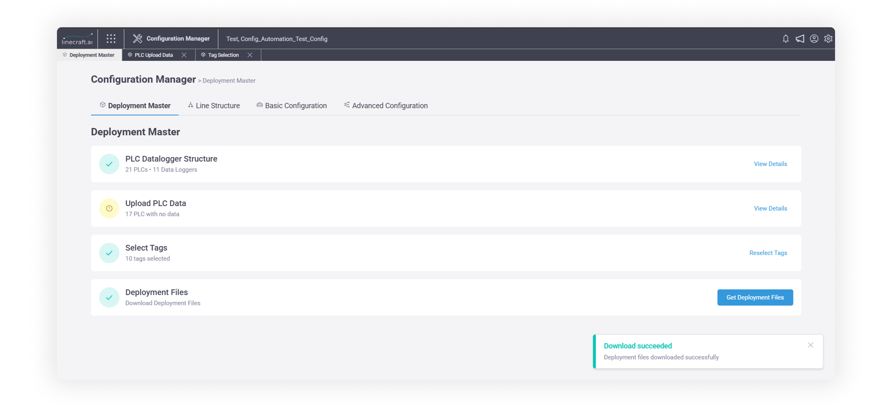

# ⚙️ Config automation (Deployment Master)

&#x20;   \
**Overview**

This module helps configurators deploy tags on **data loggers**, which are used to collect data from **PLCs** on the production line. It simplifies the configuration process that previously required expert-level knowledge, multiple tools, and frequent back-and-forth across screens. That older flow worked, but it was slow, fragile, and easy to get wrong.

This module replaces that approach with a **guided, sequential workflow** that:

·       Reduces configuration time significantly

·       Minimizes mistakes by enforcing rules early

·       Makes the process usable by non-experts

·       Produces consistent, deployment-ready outputs

Users just have to now define what physically exists (PLCs and Data Loggers).\
The system derives everything else and guides users step by step.

In a nutshell

You **Configure**

·       Data Loggers

·       PLCs connected to those Data Loggers

·       Which tags/signals you want deployed

And **The System Handles**

·       OPC creation

·       Driver compatibility

·       Tag validation

·       Dependency checks

·       Deployment file generation

&#x20;

This design is deliberate. It removes the need for users to understand internal mechanics while still keeping outcomes predictable and correct. You focus on your physical setup and business needs - the system handles the technical complexity. 

End to End Flow:

&#x20;.png>)

The configuration flow is **strictly sequential**. You cannot skip steps. Unlike the old system where you could jump around, Config Automation enforces this sequence to catch problems early. This might feel restrictive at first, but it prevents deployment failures.

### Step 1: Configure Data Logger Structure

The first step is to create the **Data Logger structure.**

This step defines the **physical setup** of your line.

#### How to configure

·       Select the module Configuration Manager -> Deployment Master -> PLC Datalogger Structure

·       Download the **Excel mapping template** from the UI

·       Define:

o   Data Logger names

o   PLCs connected to each Data Logger

o   PLC types, drivers, IPs, ports

·       Upload the sheet

#### What the system does:

·       Validates all entries

·       Verifies PLC–driver compatibility

·       Automatically creates required internal mappings

<figure><figcaption></figcaption></figure>

<figure><figcaption></figcaption></figure>

<figure><figcaption></figcaption></figure>

<figure><figcaption></figcaption></figure>

#### Important validations

While configuring the structure, ensure the following:

* &#x20; You are using a **valid combination of PLC type and associated driver names**
* Supported combinations are listed in the below table

.png>)

* All data entered in the Excel sheet must follow the defined rules  &#x20;
* These rules are documented in [Appendix A](config-automation-deployment-master.md#appendix-a-data-logger-structure-validation-rules)

If the upload is successful, the system creates the required mappings automatically.

If validation fails

·       No data is saved

·       The same Excel file is returned with an Error column

·       Errors must be fixed before re-upload

### PLC Upload Data (Step 2 – Referenced Tag Filtering)

Once the structure is created, the first level of tag filtering begins. The goal of this step is to reduce noise early by identifying only the tags that are actually relevant

At this stage, you upload **PLC backups** (if available). Only **referenced tags** from these backups move forward to the next step.

Earlier, this process required multiple manual steps in Hyperspace. With this module, those steps are fully automated.

You can complete this step in one of two ways.

#### Option A: Backup upload – folder structure

Use this when PLC backups are available. Backups must be uploaded in **unzipped format** using the following hierarchy (mandatory):

Parent Folder \
&#x20;└── PLC Backup Folder (one per PLC) \
&#x20;     ├── Backup file \[AJ5]  (.ap16,.ap17, .ap18, acd)\
&#x20;     └── Supporting folders/files\
 

<figure><figcaption></figcaption></figure>

Folder structure example:

<figure><figcaption></figcaption></figure>

<figure><figcaption></figcaption></figure>

After uploading the parent folder:

·       Each PLC backup folder becomes available for mapping

·       You can map each folder to the corresponding PLC

·       Click Upload & Process

#### System-enforced rules

The system automatically validates that:

·       PLCs can only be mapped to **compatible backup folders**

·       Folder hierarchy is correct

·       No ZIP files are present

·       Only one backup folder is mapped to one PLC (1:1 mapping)

·       All required drivers for a PLC are already created in Step 1 -Data Logger structure

Any violation of these rules results in an error.

#### Upload & processing behavior

·       Click **Upload & Process Mapped Files** to start

·       Upload can be cancelled mid-way

·       Once upload completes, processing **cannot be terminated**

·       Processing runs in the background; you can continue using the product

·       Status can be tracked from the **PLC Upload Data** tab

·       Only referenced tags from the backup move forward.

#### Supported PLC backups

Currently, automated processing supports: 

* **Siemens PLC**\
  \
  &#x20;Kepware\_DA\
  Kepware\_Symbolic\
  TAKEBISHI\_DA\
  TAKEBISHI\_SYMBOLIC\
  TAKEBISHI\_OPCUA\
  KEPWARE\_OPCUA\
  LINECRAFT 
* **Allen Bradley PLC**\
  \
  KEPWARE\_AB\
  TAKEBISHI\_AB\
  FACTORYTALKS\_AB 
* &#x20;For only Siemens CNC Sinumerik driver is applicable
* &#x20;Siemens PLC can have Linecraft driver but it won't work with parser

<figure><figcaption></figcaption></figure>

### Option B: CSV Tag Upload (When PLC Backups Are Not Available)

If PLC backups are not available for the supported manufacturers, you can upload tags manually using a **CSV file**.

<figure><figcaption></figcaption></figure>

#### CSV upload – folder structure

Parent Folder \
&#x20;└── Individual CSV tag files (one per PLC)

#### CSV validation rules

The following validations apply:

·       If a PLC has multiple drivers:\
\- Tags for **all drivers must be present** in the CSV

·       If tags exist for a driver:\
\- That driver **must already be created** in the Data Logger structure

·       CSV must contain tags o**nly for the corresponding PLC**

·       Tags for incompatible drivers will result in an error

Field-level CSV rules are documented in [Appendix B](config-automation-deployment-master.md#appendix-b-csv-tag-sheet-validation-rules)\
CSV template is provided in [Appendix C](config-automation-deployment-master.md#appendix-c-csv-tag-sheet-template)

#### Versioning constraints

·       Once a **backup is uploaded and successfully processed**, you cannot upload another backup or CSV for that PLC

·       PLCs that used CSV tags earlier can upload a new CSV

·       Backups cannot be uploaded for PLCs that already used CSV tags

This restriction avoids versioning complexity and will be relaxed in future releases.

#### Failure handling

·       If parsing cannot start due to an issue:

o   The uploaded backup remains available

o   Parsing is automatically retried when the **PLC Upload Data** page is reloaded

At the end of this step, you receive a list of **referenced tags**, ready for further filtering.

### Tag Selection (Step 3 – Final Tag Shortlisting)

In this step, you select the final set of tags to deploy.

Why Two Stages of Filtering

PLC backups can contain thousands of tags. This step filters to only the ones your PLC program actually uses, dramatically reducing the volume you need to review in Step 3.

How tags are organized

Tags are logically organized into main groups and sub-groups. To assist selection, the page provides three key tools:

<figure><figcaption></figcaption></figure>

#### 1. Signal-based selection (Left Pane)

·       Groups are associated with signals. Selecting a signal sorts relevant tags in the right pane

·       Each group displays a **confidence score** generated by the ML algorithm

·       Some signals are marked as **Default**

o   Default signals cannot be edited, deleted, or uploaded via UI

·       You can upload **custom signals** using Excel

o   Download the existing signal template from the UI

o   Header and column names must remain unchanged

#### 2. IntelliSearch (Left Pane)

·       Helps quickly find a signal when the list is large

·       Once selected, the same signal-based sorting applies

#### 3. Literal search (Right Pane)

·       Performs direct text matching

·       Sorting priority:

o   Matching groups

o   Matching sub-groups

o   Matching tag name / FU / TU

#### Auto-selected tags

·       Tags uploaded via CSV are auto-selected

·       This assumes the CSV already contains only required tags

#### Review & Save

* Click **Review Tags** to see:

\-  Total selected tag count

\- Tag distribution across Data Loggers and PLCs 

<figure><figcaption></figcaption></figure>

* If the summary looks correct, click **Save**
* You can modify tag selections later if needed

#### Why This Step Matters

This is where you make business decisions about what data matters. The system guides you with signals and confidence scores, but the final call about what to deploy is yours.

### Step 4 - Deployment Files

Once tags are saved, click **Get Deployment Files** from the landing page.

Deployment packages are generated **per data logger**, containing:

·       Required XML configuration files

o   IO.xml

o   PLC.xml

o   OPCUA.xml

o   Developer Parameter.xml

o   System Parameter.xml

<figure><figcaption></figcaption></figure>

### Important Note on Process Flow

The journey to generate deployment files is **strictly sequential**.

·       Each step is enabled only after the previous step is completed

·       The landing page provides a clear summary of:

o   Completed steps

o   Pending actions

This ensures consistency and avoids partial or invalid configurations.

#### You're Done!

At this point, you have everything needed to deploy your configuration. The files contain all the technical details - you don't need to understand OPC, drivers, or any of the internal mechanics

#### Why This Flow Works

Compared to the earlier approach, Config Automation:

·       Eliminates tool switching

·       Pushes validation upfront

·       Prevents partial configurations

·       Reduces dependency on individual expertise

·       Errors are caught where they occur, not after deployment

**The Old Way vs. New Way**

·       Previously: Jump between tools → Make assumptions → Deploy → Find errors → Fix → Repeat.

·       Now: Follow steps → System validates → Deploy → Works.

&#x20;

#### Key Takeaways

·       The process is linear and enforced

·       You define physical reality; the system derives everything else

·       Tag filtering happens in two stages to reduce noise

·       Configuration time is significantly reduced

·       Outcomes are predictable and repeatable

&#x20;

&#x20;

 

&#x20;

### Appendix A: Data Logger Structure – Validation Rules

The **Data Logger Structure Excel sheet** is validated against the following rules before processing:

#### Sheet-level validations

1\.  Sheet name must be exactly **Deployment Master**

2\.       Sheet must contain data (cannot be empty)

3\.       Header row must be present, even if no data rows exist

4\.       Header names must:

a.       Match exactly

b.       Appear in the same sequence as defined

5\.       Blank cells are not allowed, **except for Port Number**

#### Data consistency validations

6\.       **Cardinality rule**:

a.       One Data Logger can map to multiple **Controllers**

b.       A Controller cannot map to multiple Data Loggers

7\.       The following combination must be **unique:**

DataLogger\_Name + ControllerName + ControllerType + Driver + IP Address + Port Number

8\.       (ControllerType + Driver) must be a **valid combination**, as defined in the table in details under Step 1

#### Error handling

·       If any validation fails:

o   An **Error** column is appended after the PortNumber column

o   The updated sheet is returned to the UI

o   **No database write** is performed

&#x20;

### Appendix B: CSV Tag Sheet – Validation Rules

The CSV tag file is validated using the following rules:

#### File & structure validations

1\.       Empty CSV file is not allowed

2\.       Header row must be present

3\.       CSV must contain exactly 11 columns

4\.       Column sequence must match the defined template

5\.       Header names must be valid and exact

#### Field-level validations

6\.       Blank cells are not allowed, except for:

a.       Comment

b.       Technical Unit (TU)

c.       Name

d.       Frequency Parameter

e.       Resolution

f.         Negated

7\.  Data types must be valid values from global\_enums (UNKNOWN, Real, Boolean, Byte, Int, Double, String, Word, Dint, Char, Dword, Float, Long, Chararray, Bytearray, Sint)\[AJ8]&#x20;

8\.  Driver name must exist in driverName column as defined in the table in details under Step 1

9\.  Duplicate rows (entire xx match) are not allowed

10\.  Allowed characters for functional unit / techincal unit / tag - \`a-z\`, \`A-Z\`, \`0-9\`, \`\_\`, \`(\`, \`)\`, \`\[\`, \`]\`

11\.  Allowed characters for name - \`a-z\`, \`A-Z\`, \`0-9\`, \`\_\`, \`"\`, \`'\`, \`'\`, \`'\`, \`"\`, \`"\`

12\.  Allowed characters for address - \`a-z\`, \`A-Z\`, \`0-9\`, \`\_\`, space, \`.\`, \`(\`, \`)\`, \`\[\`, \`]\`, \`"\`, \`"\`, \`"\`\[DP9]&#x20;

13\.  Allowed characters for Comment - \`a-z\`, \`A-Z\`, \`0-9\`, \`\_\`, space, \`,\`, \`!\`, \`?\`, \`;\`, \`:\`, \`'\`, \`"\`, \`'\`, \`'\`, \`"\`, \`"\`, \`(\`, \`)\`, \`-\`, \`/\`, \`&\`, \`\[\`, \`]\`

14\.  Allowed values for Negated - Blank, \`true\`, \`false\`, \`1\`, \`0\`, \`t\`, \`f\`, \`y\`, \`n\`, \`yes\`, \`no

#### Data normalization rules

10\.  If Name contains double quotes, they are converted to single quotes

11\.  Allowed values for Negated, FALSE, F, TRUE, T, Yes, No, 0, 1. \[AJ10] \[MS11] Default value is False\[AJ12] \[MS13]&#x20;

12\.  Data types are case-sensitive

#### Allowed data types for tags

For Linecraft driver:

UNKNOWN, Real, Boolean, Byte, Int, Double, String, Word, Dint, Char, Dword, Float, Long, Chararray, Bytearray, Sint\[AJ14] \[AJ15] \[AJ16] \[MS17] \[AJ18] \[AJ19]&#x20;

&#x20;

For Kepware driver:

Boolean, Byte, Char, Dword, Double, Real, Long, Dint, Word, String, Short, Float, Int, Bytearray, Chararray

#### Numeric field validations

14\.  Frequency Parameter (This is the polling rate of tags/data from the PLC):

a.  Blank or values between 0–9

&#x20;  i.  What does each of the above values mean?

1\.   0 – 10ms (Defaulted when left blank)

2\.  1 - 50 ms

3\.  2 - 470 ms

4\.  3 - 990 ms

5\.  4 - 1190 ms

6\.  5 - 5170 ms

7\.  6 - 9790 ms

8\.  7 - 15270 ms

9\.  8 - 29790 ms

10\.  9 - 59170 ms 

15\.  Resolution:

a.  Blank or values between 0.001 and 999.999

b.  Up to 3 decimal places allowed

#### Cross-record validations

16\.  If sAddress differs for the same combination of:

FU + TU + Tag\
 

→ Validation error is raised

17\.  During re-upload:

a.       If FU + TU + Tag already exists:

&#x20;         i.  Any attribute change is treated as an **update**

18\.  During re-upload:

a.       If sAddress matches an existing record but FU + TU + Tag changes:

&#x20;         i.  Error is raised indicating the address is already referenced

#### Error handling

·       If any validation fails:

o   A new Excel file with an appended Error column is returned via UI

o  **No database write** is performed

&#x20;

### Appendix C: CSV Tag Sheet Template

The CSV template to be used for manual tag upload is provided as an attachment and can also be downloaded from the UI.

[CSV tags sheet template.csv](https://parirobotics-my.sharepoint.com/:x:/g/personal/atulk_linecraft_ai/IQA_WuLJOXMcQbt7vwLDMJ37AUDZsdjdU2Xslaqe7iQuNsc?e=axyFJD)

&#x20;

***

