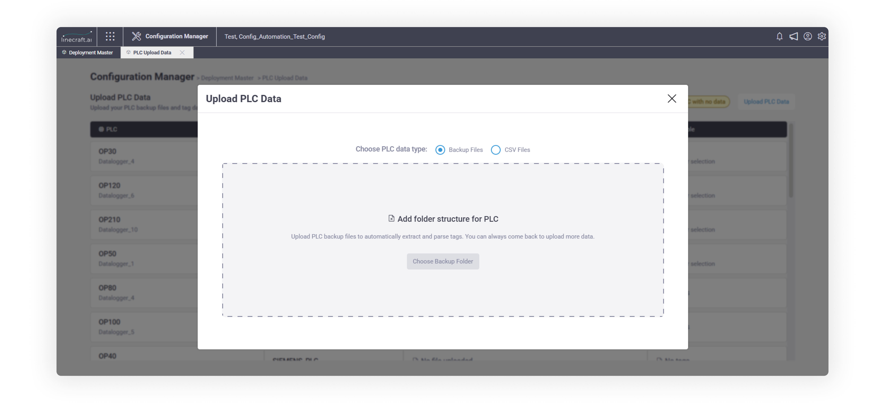
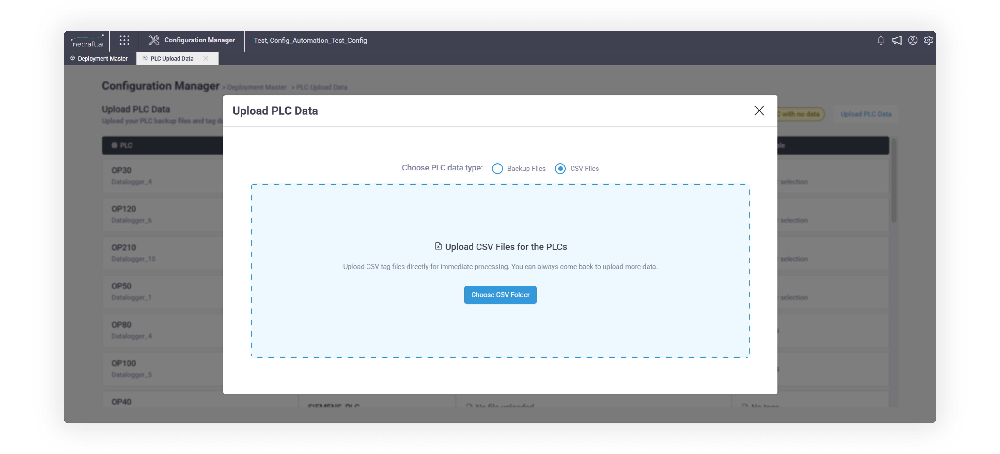
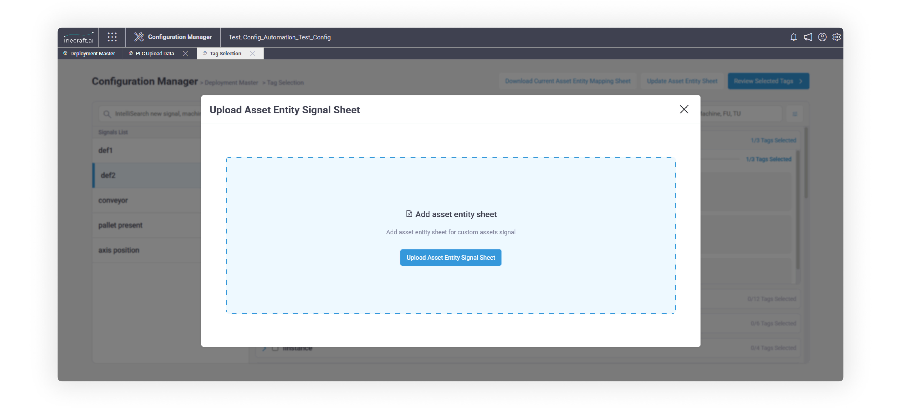
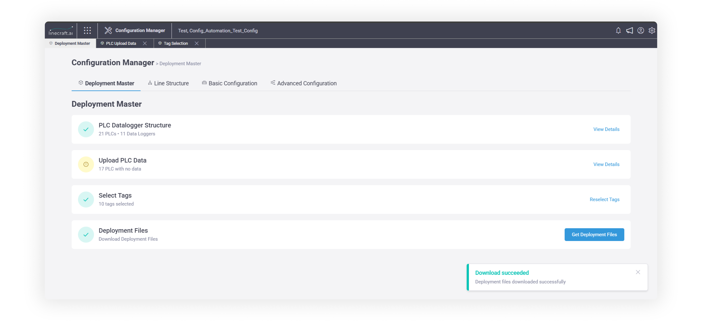

# Deployment Master

Overview


Deployment Master module guides you through a structured, four-step workflow to configure Data Loggers, map PLCs, extract tags, and generate deployment-ready files. The system enforces the sequence, validates your inputs at every stage, and handles all internal technicalities - so your configuration is consistent, complete, and ready to deploy.


<mark style="color:$warning;">**Who can use this feature?**</mark>

All users at the below role levels:

* Application Super Admin
* Organization Admin
* Line Configurator


## Before you start

<figure><figcaption></figcaption></figure>

> _Estimated time: 20-40 minutes (depending on PLC count and tag volume)_

Make sure you have the following ready:

1. Names of all Data Loggers on your line
2. PLC names, types, IP addresses, and port numbers for each Data Logger
3. PLC backup files (`.ap16`, `.ap17`, `.ap18`, or `.acd`) - or a CSV tag file if backups aren't available
4. Valid PLC type + driver combinations (refer to the `ControllerDriverConstant` table in your project database)


The workflow is strictly sequential. Each step unlocks only after the previous one is complete. You cannot skip ahead.


## How the Workflow Is Designed

&#x20;.png>)

Deploying tags to a data logger involves several interdependent technical components - OPC connections, driver compatibility, tag addressing, and deployment file structure.

Instead of requiring you to manage each component manually, the workflow asks you to define what physically exists - your Data Loggers and PLCs. The system then derives the rest: OPC creation, driver validation, tag filtering, and deployment file generation.

### Configure Data Logger Structure

Define the digital layout of your physical production line, including data loggers, PLCs and their interconnections.&#x20;



### How to configure data logger structure

<figure><figcaption></figcaption></figure>

1. Go to **Configuration Manager → Deployment Master → PLC Datalogger Structure**
2. Download the **Excel mapping template** from the UI
3. Fill in the following for each PLC:

| Field            | What to enter                                                       |
| ---------------- | ------------------------------------------------------------------- |
| Data Logger Name | Name of the data logger this PLC connects to                        |
| Controller Name  | Name of the PLC                                                     |
| Controller Type  | PLC manufacturer type (e.g., Siemens, Allen Bradley)                |
| Driver           | Communication driver (must be a valid pairing with Controller Type) |
| IP Address       | PLC network address                                                 |
| Port Number      | Optional - leave blank if not applicable                            |

4. Upload the completed sheet



### What the system does after upload

*

    <figure><figcaption></figcaption></figure>
* Validates all entries against the rules below
* Checks that each PLC type + driver combination is supported
* Automatically creates required OPC connections and internal mappings

> _If the upload is successful, the system creates everything it needs - you don't need to configure OPC or drivers manually._



### What if validation fails

* **Nothing is saved** - no partial writes occur
* You receive the same Excel file back, with an additional **Error** column appended after the Port Number column
* Each row that failed shows the specific error
* Fix the flagged rows and re-upload


**Only fix what's flagged.** You don't need to re-enter the entire sheet. Correct the rows with errors and upload again.


<details>

<summary>Important validations</summary>

* **Controller Type + Driver must be a valid combination.** Supported pairings are defined in the below table. Using an unsupported combination will block the upload.

<figure><figcaption></figcaption></figure>

* **One PLC cannot map to more than one Data Logger.** A Data Logger can have many PLCs, but each PLC belongs to only one Data Logger.
* **The combination of Data Logger + Controller Name + Controller Type + Driver + IP + Port must be unique.** No duplicate rows.
* **All fields are mandatory except Port Number.** Blank cells in any other column will cause a validation error.
* **Sheet name must be exactly** `Deployment Master` - any variation will cause the upload to fail.
* **Column headers must be present and in the correct order.** Do not reorder or rename columns.

> _Full validation rules are documented in the Validation Rules - Data Logger Structure section._

</details>



### Upload PLC Data&#x20;

<figure><figcaption></figcaption></figure>

Once the Data Logger structure is confirmed, the system needs to know which tags exist on each PLC. This performs the first level of tag filtering — narrowing down from potentially thousands of tags to only those that are actually referenced in your PLC program.

You have two options depending on whether PLC backup files are available.



### Upload PLC backup files

<figure><figcaption></figcaption></figure>

Use this when you have backup files for your PLCs. This is the recommended path when backups are available, as the system can automatically extract only the referenced tags.

**Supported backup formats:** `.ap16`, `.ap17`, `.ap18`, `.acd`

**Folder structure (mandatory)**

Your upload must follow this exact hierarchy:

```
Parent Folder
└── PLC Backup Folder (one per PLC)
    ├── Backup file (.ap16 / .ap17 / .ap18 / .acd)
    └── Supporting folders and files
```


Do not upload a ZIP file. The parent folder must be uploaded **unzipped**. ZIP files will cause a validation error.


<details>

<summary>More on how to upload</summary>

**How to upload**

1. Upload the **parent folder** (not individual PLC folders)
2. Each PLC backup folder will appear in the UI for mapping
3. Map each folder to its corresponding PLC
4. Click **Upload & Process Mapped Files**

**System-enforced rules**

* Each PLC backup folder maps to exactly one PLC (1:1 mapping)
* The folder hierarchy must match the structure above
* All drivers for a PLC must already be created in Step 1
* PLCs can only be mapped to compatible backup folders

**Upload and processing behaviour**

* You can cancel an upload mid-way
* Once upload completes, processing cannot be stopped
* Processing runs in the background - you can continue using the platform
* Track processing status from the **PLC Upload Data** tab
* If processing fails to start, the uploaded backup is retained and automatically retried when you reload the PLC Upload Data page

**Supported PLCs and drivers for automated processing**

<table><thead><tr><th width="186.79998779296875">PLC Type</th><th>Supported Drivers</th></tr></thead><tbody><tr><td><strong>Siemens PLC</strong></td><td>Kepware_DA, Kepware_Symbolic, TAKEBISHI_DA, TAKEBISHI_SYMBOLIC, TAKEBISHI_OPCUA, KEPWARE_OPCUA, LINECRAFT</td></tr><tr><td><strong>Allen Bradley PLC</strong></td><td>KEPWARE_AB, TAKEBISHI_AB, FACTORYTALKS_AB</td></tr><tr><td><strong>Siemens CNC</strong></td><td>Sinumerik (only)</td></tr></tbody></table>


**Note on Linecraft driver for Siemens PLC:** The Linecraft driver can be assigned to a Siemens PLC in the structure, but it is not supported by the tag parser. Tags from this driver combination will not be automatically extracted.


</details>



### Upload a CSV Tag File

<figure><figcaption></figcaption></figure>

Use this when PLC backup files are not available. You manually provide the tag list for each PLC using a CSV file.

> _**Download our CSV template**. Do not create your own format._

#### CSV upload – folder structure

```
Parent Folder
└── One CSV file per PLC
```

<details>

<summary>CSV upload guidelines</summary>

* If a PLC has multiple drivers, tags for **all** drivers must be present in the CSV
* Tags must only belong to the PLC the CSV is being uploaded for
* The driver referenced in each tag must already exist in the Data Logger structure from Step 1
* Tags for incompatible or unrecognized drivers will result in an error
* An empty CSV file is not accepted

> _Full field-level CSV validation rules are documented in the Validation Rules - CSV Tag Upload section._

**Important: Re-upload constraints**

<table><thead><tr><th width="300.39996337890625">Scenario</th><th>What's allowed</th></tr></thead><tbody><tr><td>PLC originally used a backup file</td><td>Cannot upload another backup or a CSV for that PLC</td></tr><tr><td>PLC originally used a CSV</td><td>Can upload a new CSV to update tags</td></tr><tr><td>PLC originally used a CSV</td><td>Cannot switch to a backup file upload</td></tr></tbody></table>

> _This restriction prevents versioning conflicts. Re-upload flexibility for backup-based PLCs will be introduced in a future release._

</details>



### Select Tags

<figure><figcaption></figcaption></figure>

This is where you make the final decision about which tags get deployed. The system has already reduced the tag volume through extraction. Now you review and confirm the deployment set.

<details>

<summary>How tags are organized</summary>

<figure><figcaption></figcaption></figure>

Tags are grouped into **main groups** and **sub-groups** based on functional and technical units. Three tools help you navigate and select:

**Signal-based selection (left pane)**

* Each group is associated with a **signal** (e.g., a specific production metric or equipment behaviour)
* Selecting a signal sorts relevant tags in the right pane
* Each group shows a **confidence score** — generated by the ML algorithm — indicating how well the tags align with the expected signal pattern
* Some signals are marked as **Default**. These cannot be edited, deleted, or overridden via UI upload

**Adding custom signals:**

* Download the signal template from the UI
* Fill in your signal definitions — do not change header or column names
* Upload the completed file

**IntelliSearch (left pane)**

* Use this to quickly find a signal when the list is long
* Once selected, the same signal-based tag sorting applies

**Literal search (right pane)**

* Performs direct text matching across tag names, functional units (FU), and technical units (TU)
* Results are sorted: matching groups first, then sub-groups, then individual tags

#### Auto-selected tags

Tags uploaded via CSV in Step 2 are automatically selected. This reflects the assumption that a manually prepared CSV already contains only the tags you need.

#### Review and save

1.

    <figure><figcaption></figcaption></figure>
2. Click **Review Tags**
3. Confirm:
   * Total selected tag count
   * Tag distribution across Data Loggers and PLCs
4. If the summary looks correct, click **Save**

> You can return and modify tag selections later if needed - this step is not final until deployment.

</details>



### Generate deployment files

<figure><figcaption></figcaption></figure>

Once tags are saved, return to the landing page and click **Get Deployment Files**.

The system generates a deployment package per Data Logger. Each package contains the XML configuration files required for deployment:

<table><thead><tr><th width="253.20001220703125">File</th><th>Purpose</th></tr></thead><tbody><tr><td><code>IO.xml</code></td><td>IO signal mapping</td></tr><tr><td><code>PLC.xml</code></td><td>PLC connection configuration</td></tr><tr><td><code>OPCUA.xml</code></td><td>OPC UA server configuration</td></tr><tr><td><code>Developer Parameter.xml</code></td><td>Developer-level parameters</td></tr><tr><td><code>System Parameter.xml</code></td><td>System-level parameters</td></tr></tbody></table>

> _You do not need to understand the internal structure of these files. They are deployment-ready outputs - hand them off directly to your deployment process._



## Validation Rules - Data Logger Structure

Reference this section when your Step 1 upload fails.

#### Sheet structure

<table><thead><tr><th width="238.79998779296875">Rule</th><th>Detail</th></tr></thead><tbody><tr><td>Sheet name</td><td>Must be exactly <code>Deployment Master</code></td></tr><tr><td>Sheet content</td><td>Cannot be empty</td></tr><tr><td>Header row</td><td>Must be present, even if no data rows follow</td></tr><tr><td>Column order</td><td>Must match the defined template exactly</td></tr><tr><td>Header names</td><td>Must match exactly - no variations</td></tr></tbody></table>

#### Field rules

<table><thead><tr><th width="262.79998779296875">Rule</th><th>Detail</th></tr></thead><tbody><tr><td>Blank cells</td><td>Not allowed, except for Port Number</td></tr><tr><td>Controller Type + Driver</td><td>Must be a valid combination per <code>ControllerDriverConstant</code> table</td></tr><tr><td>One PLC → one Data Logger</td><td>A Controller cannot be mapped to more than one Data Logger</td></tr><tr><td>Uniqueness</td><td>The combination of DataLogger_Name + ControllerName + ControllerType + Driver + IP Address + Port Number must be unique</td></tr></tbody></table>

#### What happens on failure

* An `Error` column is appended to the right of the Port Number column
* The updated file is returned to the UI
* No data is written to the database
* Fix flagged rows and re-upload

## Validation Rules - CSV Tag Upload

Reference this section when your Step 2 CSV upload fails.

#### File and structure rules

* CSV cannot be empty
* Header row must be present
* Must contain exactly **11 columns** in the defined sequence
* Column headers must match the template exactly

#### Field rules

| Field                                                       | Rule                                                    |
| ----------------------------------------------------------- | ------------------------------------------------------- |
| Most fields                                                 | Cannot be blank                                         |
| Comment, TU, Name, Frequency Parameter, Resolution, Negated | May be blank                                            |
| Data type                                                   | Must be a valid value (case-sensitive) - see list below |
| Driver name                                                 | Must exist in `ControllerDriverConstant`                |
| Duplicate rows                                              | Not allowed (full-row match)                            |

**Allowed characters:**

| Field         | Allowed characters                                                                                  |
| ------------- | --------------------------------------------------------------------------------------------------- |
| FU / TU / Tag | `a-z`, `A-Z`, `0-9`, `_`, `(`, `)`, `[`, `]`                                                        |
| Name          | `a-z`, `A-Z`, `0-9`, `_`, and quote variants                                                        |
| Address       | `a-z`, `A-Z`, `0-9`, `_`, space, `.`, `(`, `)`, `[`, `]`, quotes, `-`                               |
| Comment       | `a-z`, `A-Z`, `0-9`, `_`, space, `,`, `!`, `?`, `;`, `:`, quotes, `(`, `)`, `-`, `/`, `&`, `[`, `]` |

**Frequency Parameter** (polling rate from PLC):

| Value        | Polling rate   |
| ------------ | -------------- |
| Blank or `0` | 10ms (default) |
| `1`          | 50ms           |
| `2`          | 470ms          |
| `3`          | 990ms          |
| `4`          | 1,190ms        |
| `5`          | 5,170ms        |
| `6`          | 9,790ms        |
| `7`          | 15,270ms       |
| `8`          | 29,790ms       |
| `9`          | 59,170ms       |

**Resolution:** Blank, or a value between 0.001 and 999.999 (up to 3 decimal places)

**Negated:** Accepted values: `true`, `false`, `1`, `0`, `t`, `f`, `y`, `n`, `yes`, `no`, or blank. Defaults to `False`.

#### Allowed data types by driver

**Linecraft driver:** `UNKNOWN`, `Real`, `Boolean`, `Byte`, `Int`, `Double`, `String`, `Word`, `Dint`, `Char`, `Dword`, `Float`, `Long`, `Chararray`, `Bytearray`, `Sint`

**Kepware driver:** `Boolean`, `Byte`, `Char`, `Dword`, `Double`, `Real`, `Long`, `Dint`, `Word`, `String`, `Short`, `Float`, `Int`, `Bytearray`, `Chararray`

_Note: For Kepware drivers, `Int` is converted to `Short` and `Chararray` is converted to `Char Array` internally._

#### Cross-record rules

* If the same `FU + TU + Tag` combination has different addresses across rows → validation error
* On re-upload: if `FU + TU + Tag` already exists, any attribute change is treated as an update
* On re-upload: if an address already exists but the `FU + TU + Tag` combination changes → error (address is already referenced)

#### What happens on failure

* A new Excel file with an appended `Error` column is returned via the UI
* No data is written to the database
* Fix flagged rows and re-upload

## Error Handling

| Situation                                            | What happens                                       | What to do                            |
| ---------------------------------------------------- | -------------------------------------------------- | ------------------------------------- |
| Step 1 upload fails validation                       | Error file returned with flagged rows              | Fix errors, re-upload                 |
| Step 2 backup parsing fails to start                 | Backup is retained; parsing retries on page reload | Reload the PLC Upload Data page       |
| Step 2 CSV upload fails                              | Error file returned with flagged rows              | Fix errors, re-upload                 |
| Step 2 upload cancelled mid-way                      | Upload stops; no data is processed                 | Re-upload the complete folder         |
| Step 2 upload completed but processing still running | Processing continues in background                 | Track status from PLC Upload Data tab |

## Common Mistakes

Avoid these before uploading:

* **Uploading a ZIP file** in Step 2 - unzip your parent folder before uploading
* **Missing or renamed column headers** in the Excel or CSV - headers must match the template exactly
* **Invalid PLC type + driver combination** - verify against the `ControllerDriverConstant` table before filling the sheet
* **Mapping one PLC to multiple Data Loggers** - each PLC belongs to exactly one Data Logger
* **Using an unsupported data type in a CSV** - data types are case-sensitive and driver-specific
* **Leaving required fields blank** - only specific optional fields may be blank; all others are mandatory
* **Trying to switch from CSV to backup upload** - once a PLC is configured via CSV, it must stay on the CSV path
