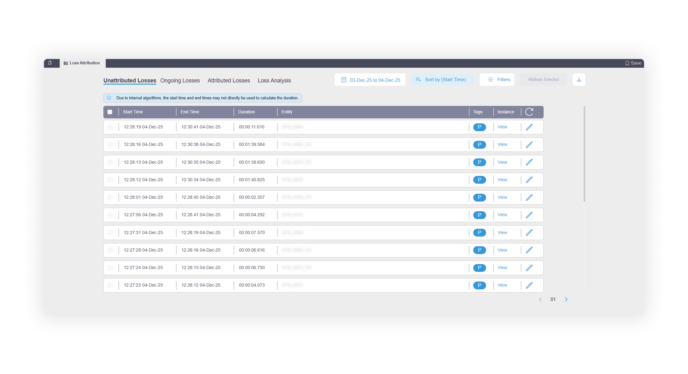
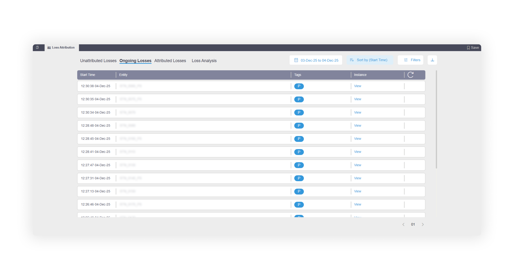
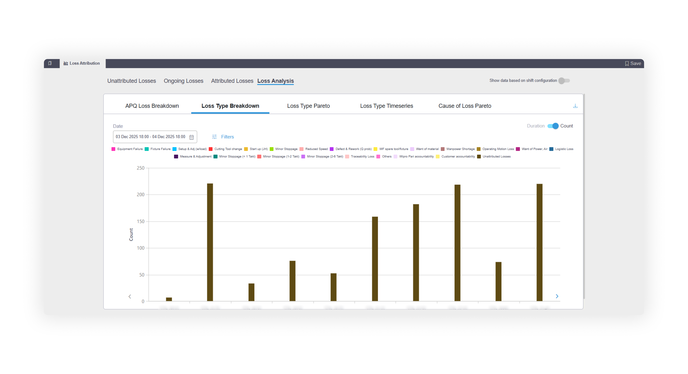
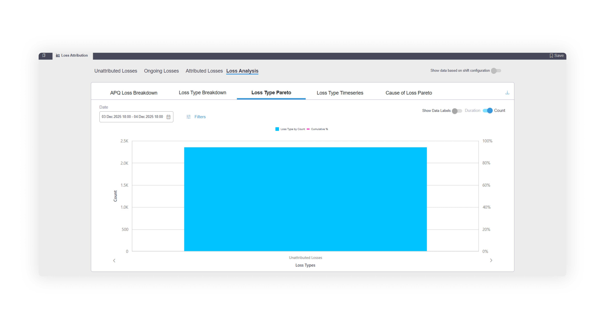
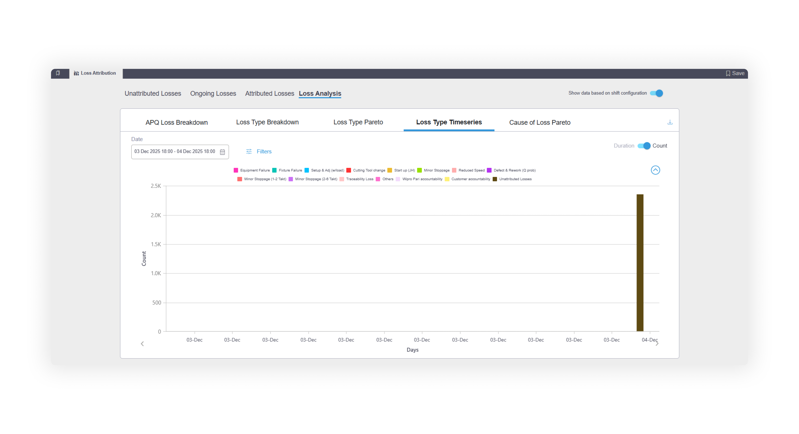
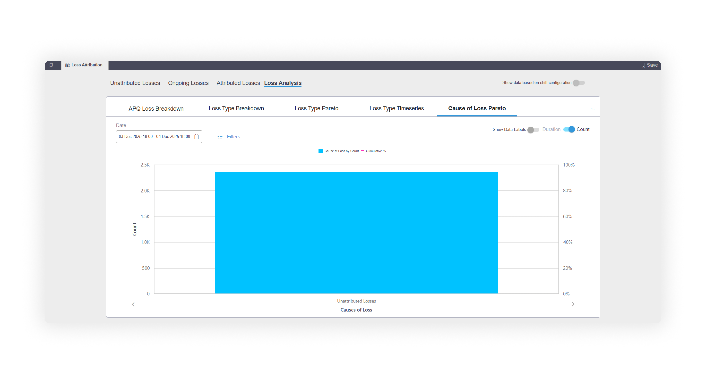

# 📉 Loss management

## Overview

The loss management feature allows the user to attribute losses on the production line and use these attributions to track and analyze the losses on their line.

<figure><figcaption></figcaption></figure>

This feature can be accessed from multiple points in the product:

#### Availability drill downs

When the user accesses Downtime Causes List, all the non-production losses recorded will get displayed in the table. Then the user can attribute losses instance-wise.

<figure><figcaption></figcaption></figure>

User can use the toggle button to switch between “Attribution States List” and “Downtime Causes List”. When the user hovers on an attributed Loss Type, they can see the Cause of Loss on a tooltip.

<figure><figcaption></figcaption></figure>

#### Performance drilldowns

User can attribute losses instance-wise while comparing multiple cycles and while looking at a cycle’s high level interaction graph.

<figure><figcaption></figcaption></figure>

#### Part trace module

From the Part Tracing module, user can individually attribute loss from each bad part reported, from each exceeded cycle time and directly from process parameter section.

<figure><figcaption></figcaption></figure>

#### Bottlenecks module

From the Bottlenecks module, user can navigate to _Opportunities_ section and attribute losses either per instance or per opportunity type in the stuck states section. The dropdown shows all instances and the user can multiselect instances and attribute them at the same time.

<figure><figcaption></figcaption></figure>

The loss attribution feature has 4 major sections:

#### Unattributed losses

All losses that are not attributed yet, will be populated in the table on this page.

To attribute a single loss, the user will click on the edit button which enables data entry. For Cause of Loss, Fix and Remarks, the user will get auto suggestions as they start typing.

<figure><figcaption></figcaption></figure>

To attribute cumulatively, the user can select multiple losses and click on the “attribute selected” button which will open a pop-up for them to enter the data.

<figure><figcaption></figcaption></figure>

#### Attributed losses

All losses, once attributed will move to the attributed losses tab.

<figure><figcaption></figcaption></figure>

Here, you can edit the attributed losses.

<figure><figcaption></figcaption></figure>

#### Ongoing losses

All losses that have started but don’t have an end time yet, will get recorded under ongoing losses. These losses will not have an end time or duration. As they are still ongoing, they cannot be attributed. Once the loss has an end time, it will move to the unattributed tab and can then be attributed.

<figure><figcaption></figcaption></figure>

#### Loss analysis

The loss analysis tab consists of 5 types of graphs that allow the user to get an in-depth understanding of the losses on their line.

* The APQ loss breakdown graph shows you how much loss% each asset had, and its breakdown by availability, performance and quality.

<figure><figcaption></figcaption></figure>

<figure><figcaption></figcaption></figure>

* The loss type breakdown graph shows you how much loss each asset had by count or duration, and its breakdown by loss type.

<figure><figcaption></figcaption></figure>

* The loss type pareto graph shows you how much each loss type contributed to the total loss count and duration, allowing you to analyze which loss type is the worst.

<figure><figcaption></figcaption></figure>

* The loss type timeseries graph shows you how much loss the line had per day by count or duration, and its breakdown by loss type.

<figure><figcaption></figcaption></figure>

* The cause of loss pareto graph shows you how much each cause of loss contributed to the total loss count and duration, allowing you to analyze which cause is the worst.

<figure><figcaption></figcaption></figure>
