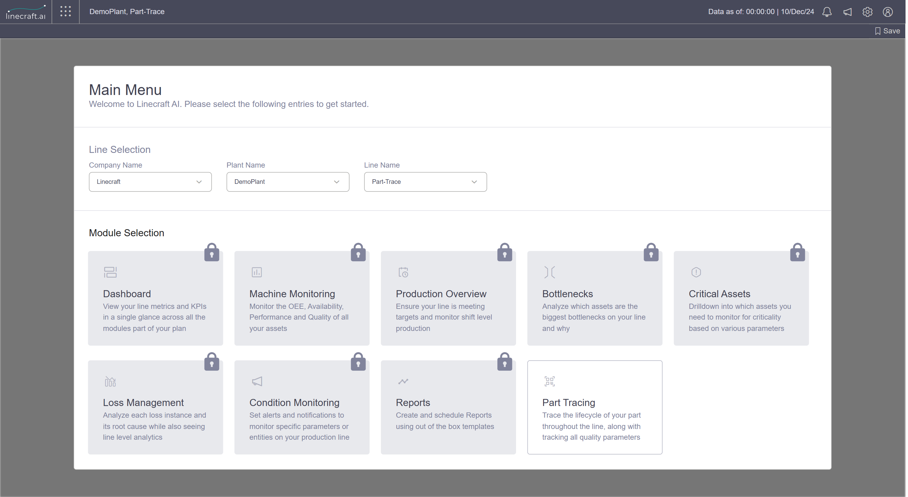
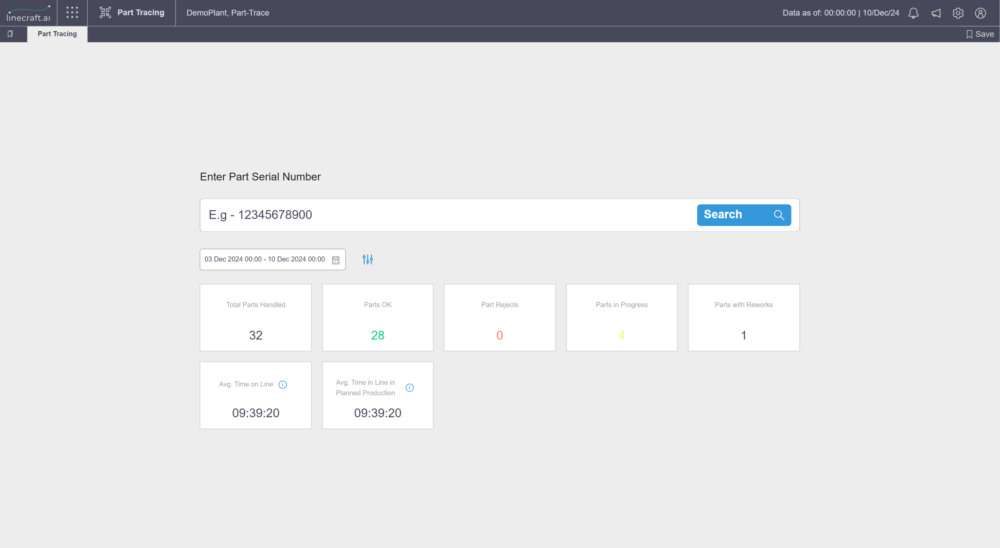

# Part Tracing V1

The Part Tracing module in Linecraft AI lets you trace the complete lifecycle of a part as it moves through your production line, while tracking all associated quality parameters. This is useful when you need to investigate part acceptance outcomes, review rework history, monitor in-progress parts, or export process data for quality reporting.

This guide walks you through opening the module, filtering by date range, searching for specific parts, analyzing process parameters using the Gantt Chart view, and exporting your results.

## Accessing the Part Tracing module

Open the Linecraft AI application. On the Main Menu screen, select Company Name, Plant Name: DemoPlant and Line Name to view all modules offered as per selected subscription plan.

Under Module Selection, locate the Part Tracing tile in the bottom right and select it. The tile is described as: _"Trace the lifecycle of your part throughout the line, along with tracking all quality parameters."_

<figure><figcaption></figcaption></figure>

Main Menu with Part Tracing module highlighted, showing company, plant, and line selection dropdowns, and all module tiles with descriptions

## Exploring the Part Tracing screen

Once the module opens, you'll see an Enter Part Serial Number input field at the top. Below it, a default date range is displayed (for example, _03 Dec 2024 00:00 – 10 Dec 2024 00:00_), along with a set of quality KPI's:

* **Total Parts Handled**
* **Parts OK**
* **Part Rejects**
* **Parts in Progress**
* **Parts with Reworks**
* **Avg. Time on Line**
* **Avg. Time in Line in Planned Production**

<figure><figcaption></figcaption></figure>

Part Tracing module initial screen with serial number input, date range, and summary statistics

## Selecting a custom date range

To analyze a specific production period, click the date range selector to open the calendar dialog. Use the left and right arrows to navigate between months, then select your start and end dates. You can also adjust the time values if needed. Click Apply to confirm your selection.

<figure><figcaption></figcaption></figure>

Calendar popup for selecting custom date range, showing March 2024 selected

After applying the new date range, the quality KPI's tiles update automatically.&#x20;

<figure><figcaption></figcaption></figure>

Updated statistics after date range selection, showing new values for all summary tiles

## Viewing part details from summary tiles

Each summary tile supports quick filtering. Hover over any tile — such as Part Rejects, Parts with Reworks, or Parts in Progress — to reveal a View button. Clicking View filters the data table to show only the parts in that category.

<figure><figcaption></figcaption></figure>

Hovering over summary tiles reveals "View" button, example on Part OK

## Searching by part serial number

To look up a specific part, click the Enter Part Serial Number field and type a serial number or partial serial. Click the blue Search button to the right of the input field to run the search.

<figure><figcaption></figcaption></figure>

Entering a serial number and clicking Search, with loading indicator

## Reviewing the part data table

After a search, a data table appears on the right side of the screen listing all parts handled within the selected date range. The left panel continues to display the summary statistics. The table includes the following columns:

* **First entered the line**
* **Part Serial Number**
* **Part Type**
* **No. of Reworks**
* **Part Acceptance (for example,&#x20;**_**Part OK**_**,&#x20;**_**In progress**_**)**
* **Non-compliant Parameters (%)**
* **Total Time on Line**
* **Time in Line in Planned Production**

<figure><figcaption></figcaption></figure>

Part data table with columns for serial number, type, reworks, acceptance, compliance, and time metrics

You can use the Filters button above the table to further refine the displayed results, or click Export As... in the top right to download the data. Use the Back button to return to the previous view.

<figure><figcaption></figcaption></figure>

Filtered table showing only "Parts in Progress" with corresponding details

## Analyzing an individual part in detail

Opening the part detail view

Click on a specific part serial number in the data table to open its detailed view. The left panel displays key metadata for that part, for example:

* **Serial Number**
* **Part Type**
* **First entered line**
* **Total time on line**
* **Time in Line in Planned Production**
* **No. of Reworks**
* **Part Acceptance**

The main panel shows a Gantt Chart area.

Part details panel with Gantt Chart area, showing part metadata

Viewing the Gantt chart

The Gantt Chart visualizes the part's journey through each asset and process on the line. Assets such as Bandage\_TFR, Belt\_Pack\_TFR, and GTU\_Ring are listed along the vertical axis. Colored bars represent:

·        Part in Machine Time — shown in blue

·        Target Cycle Time — indicated by green, red, and black dashed lines

A time bar at the bottom allows you to navigate through the process timeline.

**Switching to part process parameters**

Click the Part Process Parameters button to switch from the Gantt Chart view to the process parameters table. The table includes the following columns:

·        Asset

·        Quality Parameters

·        Min

·        Max

·        Time Stamp

·        Value

·        Aggregator

The table may show a loading state briefly before data populates.

Process Parameters table loading, with part details on the left

Once loaded, the table displays process parameter readings for each asset. Example entries include:

·        GTU\_Ring — Green\_Tyre\_weight: Min 1410, Max 1430, Value 1418 kg, Aggregator: Falling

·        Belt\_Pack\_TFR — BT\_Drum\_Housing\_at\_Unload\_Position: Min 9252, Max 9254, Value 9252.99 mm, Aggregator: Rising

·        Bandage\_TFR — Bandage\_Drum\_Housing\_at\_Drop\_Position: Min 265, Max 267, Value 266 mm, Aggregator: Falling

Green highlights indicate that a value is within its defined range.

Process Parameters table with filled data, showing assets, parameters, and values

Filtering process parameters by asset

Use the All Assets dropdown above the process parameters table to filter by a specific asset. You can select or deselect assets such as GTU\_Ring, Belt\_Pack\_TFR, or Bandage\_TFR to narrow the displayed parameters.

Asset filter dropdown in Process Parameters table

## Exporting process parameters

Exporting parameters for a single part

Click the download icon or Export As... button to open the export dialog. In the Download Process Parameters (Part) dialog, configure the following options before exporting:

·        Parameter: Select _All parameters_ or a specific parameter

·        Entity: Select _All Assets_ or a specific asset

Click Export to download the data.

Download Process Parameters dialog with parameter and entity selection

Exporting parameters across multiple parts

For broader exports, the Download Part Tracing Process Parameters dialog provides an additional option:

·        Parameter: Choose _All parameters_ or a specific parameter

·        Entity: Select from available entities

·        Part Names: Select individual part serial numbers from a searchable list, or choose _All Parts_

Click Export to download the selected data.

Download Part Tracing Process Parameters dialog with part name selection dropdown

&#x20;

<table data-header-hidden><thead><tr><th></th><th valign="top"></th></tr></thead><tbody><tr><td></td><td valign="top">Tip: Use the <em>All Parts</em> option when preparing batch quality reports that span multiple serial numbers within a date range.</td></tr></tbody></table>

## What's next

Now that you're familiar with the Part Tracing module, you can:

·        Use the Filters button on the data table to build more targeted part queries

·        Combine date range selection with serial number search to quickly isolate specific production runs

·        Export process parameter data for individual parts or across all parts for use in external quality analysis tools
