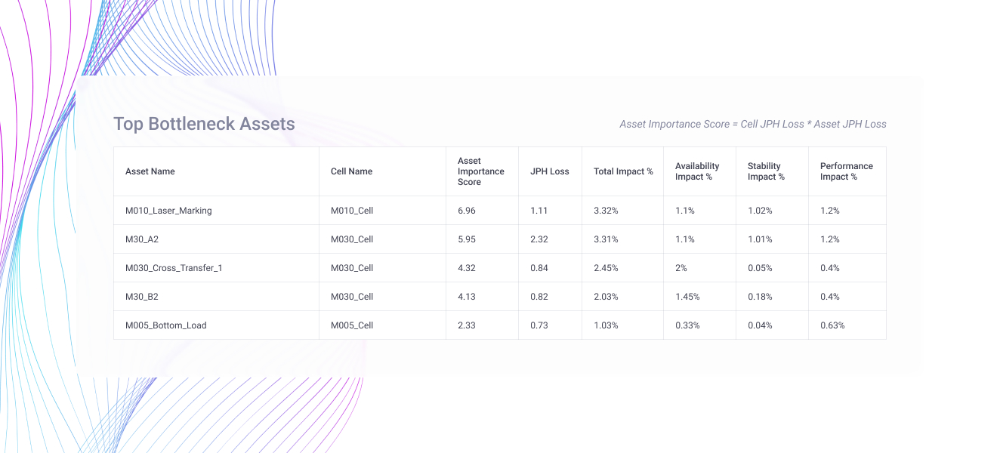
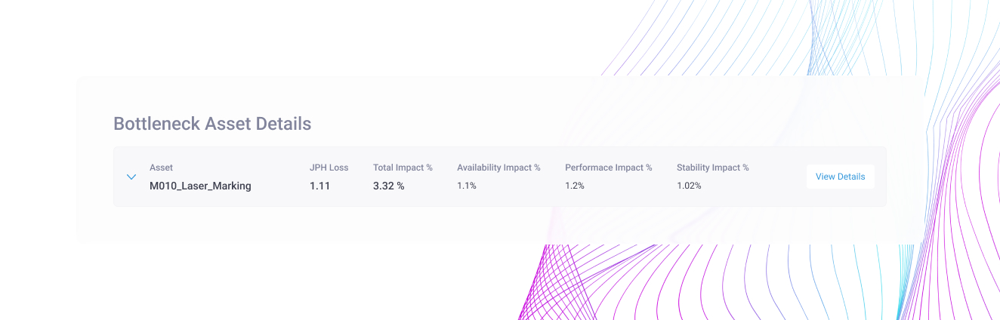
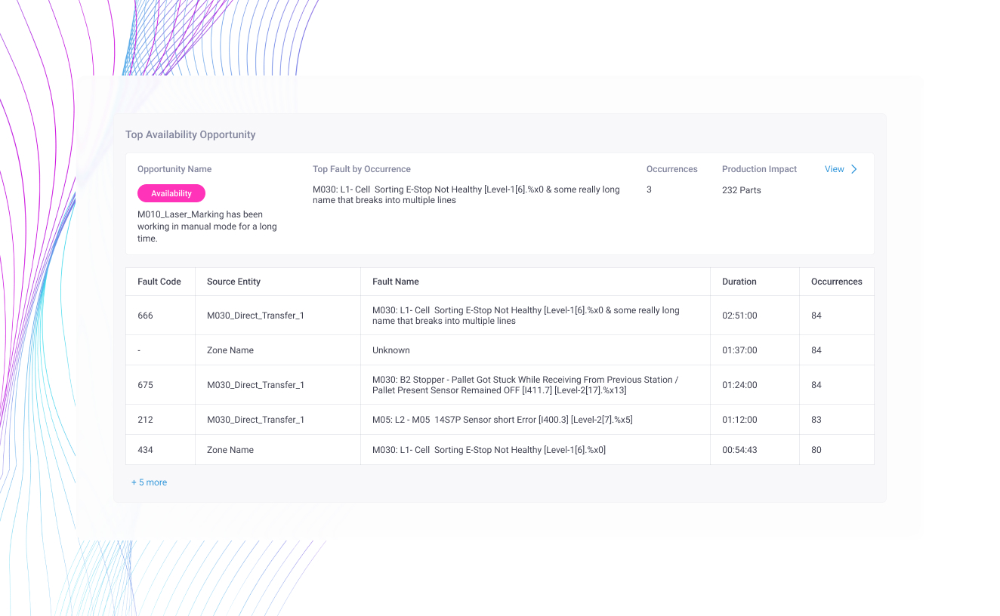
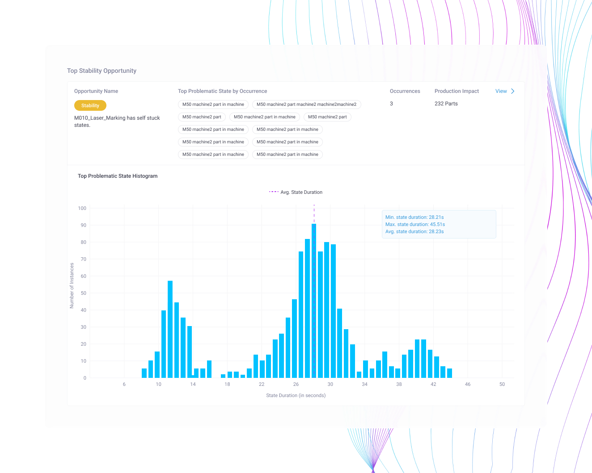
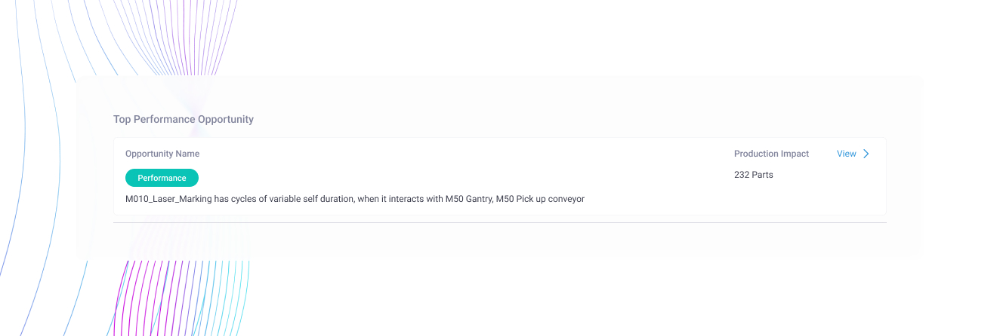
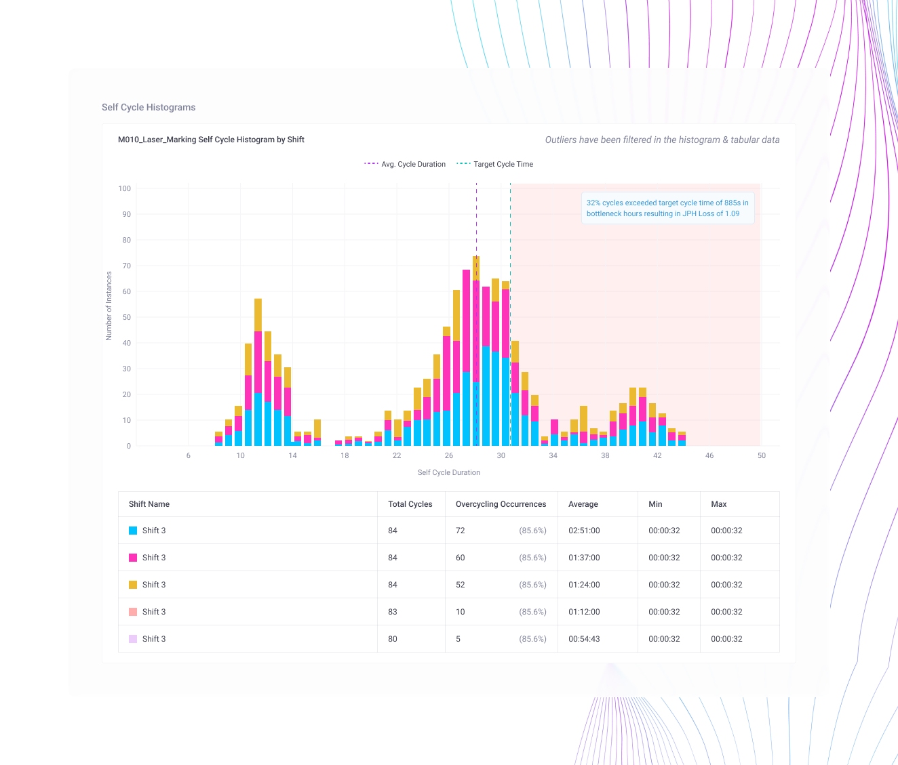
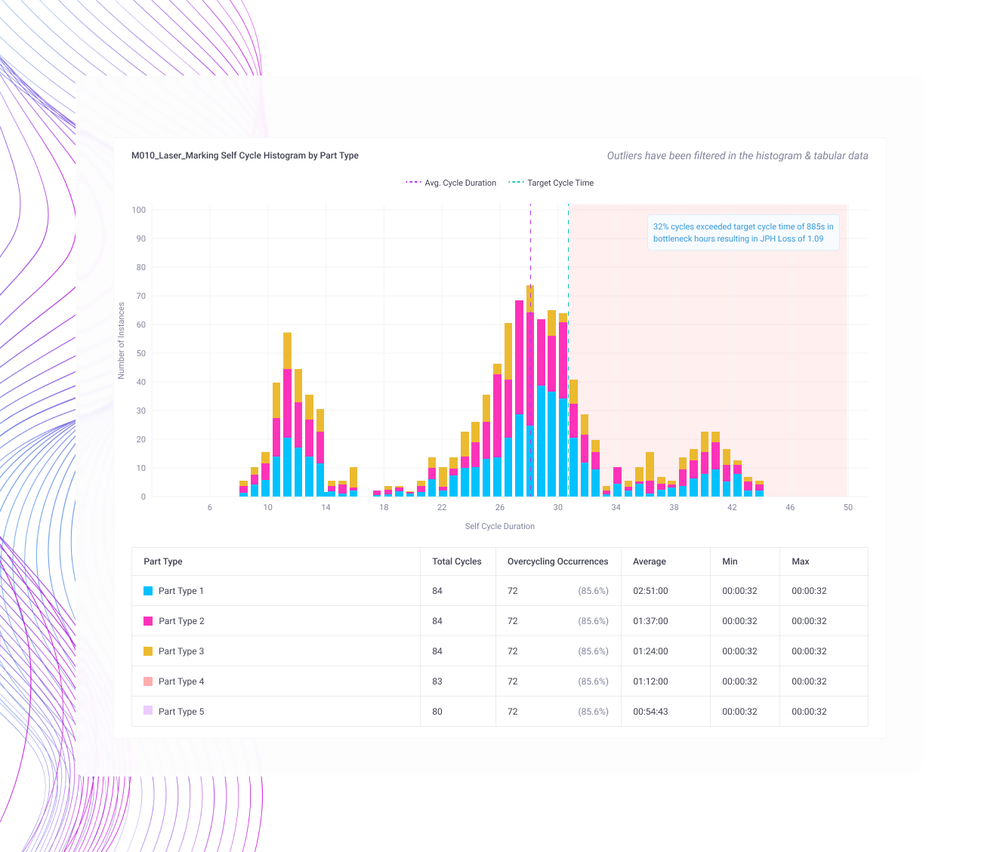

# Bottleneck Report V1

## Purpose

The Bottleneck Report provides a comprehensive week-over-week analysis of production bottlenecks, along with detailed cycle-level and state-level insights. It helps users understand the underlying causes of bottlenecks and delivers actionable recommendations to improve production performance by addressing identified issues.

The primary objective is to enable data-driven decision-making that enhances throughput and operational efficiency.

## What This Report Covers



### **Executive KPI Snapshot**

<figure><figcaption></figcaption></figure>

The report presents a consolidated summary of overall production performance, including:

* Overall Equipment Effectiveness (OEE)
* Availability
* Performance
* Quality
* Total Production

This snapshot provides leadership with a quick and clear view of operational health.



### **Identification of Bottleneck Machines**

<figure><figcaption></figcaption></figure>

Machines are ranked using a Machine Importance Score, highlighting the most impactful bottlenecks in descending order.

This prioritization enables teams to focus improvement efforts where they will generate the greatest operational benefit.



### **Structured Loss Analysis (A → P → Q Framework)**

<figure><figcaption></figcaption></figure>

For each identified bottleneck machine, opportunities are analyzed in a structured and standardized sequence:

Availability and/or Stability → Performance

This framework ensures clarity, logical prioritization, and effective root-cause analysis when multiple opportunity categories exist.



### **Top Availability Opportunity**

<figure><figcaption></figcaption></figure>

When availability losses are detected, the report provides:

* The top Availability Opportunity
* Top 10 fault codes with corresponding source entities
* Fault descriptions
* Production impact (in parts)
* Total downtime duration
* Total downtime occurrences per fault

Faults are automatically ranked by total downtime duration, allowing maintenance teams to prioritize the most impactful issues quickly.

If no availability losses are recorded, this section remains blank to maintain a clean and focused report.



### **Top Stability Opportunity**

<figure><figcaption></figcaption></figure>

When stability-related losses are identified, the report includes:

* The top Stability Opportunity
* Most problematic states ranked by occurrence
* Production impact (in parts)
* Fault descriptions



### **Top Performance Opportunity**

<figure><figcaption></figcaption></figure>

When performance-related losses are identified, the report includes:

Shift-wise and Part-type-wise Self-Cycle Histograms

These histograms highlight cycles from assets with the most inefficient cycle behavior.

They help uncover:

* Cycle time deviations
* Cycles exceeding target cycle time
* JPH (Jobs Per Hour) loss due to over-cycling
* Comparison with average and target cycle durations
* Process variability
* Throughput instability



### **Additional Shift-wise Insights**

<figure><figcaption></figcaption></figure>

**Additional Shift-wise Insights**

* Total cycles per shift
* Over-cycling occurrences
* Average cycle time
* Minimum cycle time
* Maximum cycle time



### **Additional Part-type-wise Insights**

<figure><figcaption></figcaption></figure>

* Total cycles per part type
* Over-cycling occurrences
* Average cycle time
* Minimum cycle time
* Maximum cycle time



By analyzing cycle behaviour at both shift and part-type levels, teams can stabilize line speed, reduce variability, and eliminate hidden performance inefficiencies.

If no performance opportunities are detected, this section remains blank.

## How to Use This Report

1. Review the identified bottlenecks to understand where delays are happening.
2. Analyze throughput and wait-time metrics to determine the severity of constraints.
3. Compare workflow stages to identify imbalance in workload distribution.
4. Investigate recurring patterns or trends impacting performance.
5. Prioritize improvements such as reallocating resources, optimizing workflows, or removing dependencies.
6. Monitor changes over time to measure the impact of process improvements.

The report should be used regularly as part of operational reviews and continuous improvement initiatives.

## Benefits

* Improves workflow efficiency and delivery speed
* Helps teams proactively identify operational constraints
* Reduces delays and task accumulation
* Enables better resource allocation and workload balancing
* Supports data-driven decision-making
* Enhances visibility into process performance
* Improves overall productivity and system throughput
* Helps organizations continuously optimize workflows and delivery processes

The report ultimately enables teams to move from reactive problem-solving to proactive process optimization.
