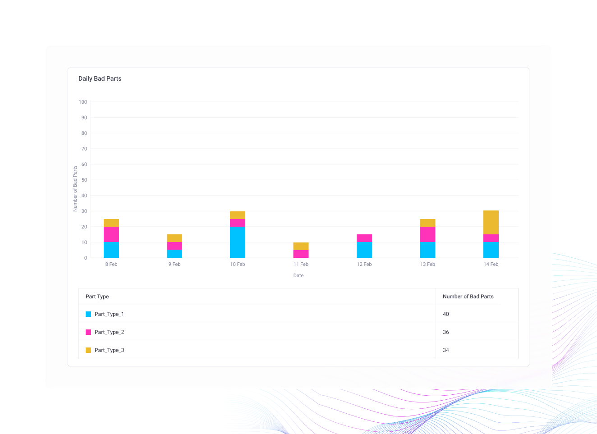

# Critical Machines Report

## Purpose

The Critical Machines Report helps manufacturers pinpoint and prioritize the machines that most significantly impact production performance.

## What This Report Covers



### **Executive KPI Snapshot**

<figure><figcaption></figcaption></figure>

The report provides a consolidated view of overall production performance, including:

* Average OEE
* Average Availability
* Average Performance
* Average Quality
* Total Production vs. Target
* End-of-Line Part Loss
* End-of-Line JPH Loss



### **Identification of Critical Machines**

<figure><figcaption></figcaption></figure>

Machines are ranked using a proprietary Machine Importance Score. The most critical machines are displayed in descending order of impact, allowing teams to focus improvement efforts where they will deliver the greatest results.

**Structured Loss Analysis (A → P → Q Framework)**

<figure><figcaption></figcaption></figure>

For each identified critical machine, losses are analysed in a structured sequence:

Availability → Performance → Quality

This standardized approach ensures clarity and proper prioritization when multiple loss categories are present.



### **Availability Loss Insights**

<figure><figcaption></figcaption></figure>

When availability losses are detected, the report presents:

* Top 5 fault codes
* Fault descriptions
* Number of occurrences
* Total downtime duration
* Average downtime per occurrence

Faults are automatically ranked by total downtime, enabling maintenance teams to quickly address the most impactful issues.

If no availability losses are recorded, this section remains blank to maintain a clean and focused view.



### **Performance Loss Insights**

<figure><figcaption></figcaption></figure>

<figure><figcaption></figcaption></figure>

If performance losses are identified, the report includes a:

Self-Cycle Histogram, covering:

* Bottleneck intervals
* Non-bottleneck intervals

This visualization helps uncover:

* Cycle time deviations
* Micro-stoppages
* Process variability
* Throughput instability

By analysing cycle behaviour, teams can stabilize line speed and eliminate hidden performance inefficiencies.

If no performance losses are detected, this section remains blank.



### **Quality Loss Insights**

<figure><figcaption></figcaption></figure>

When quality losses are present, the report displays a Bad Parts Trend Analysis, adapted to the reporting period:

* For a daily report: Hourly bad part trends
* For weekly or longer reports: Daily bad part trends

This enables identification of:

* Time-based defect patterns
* Shift-level quality variation
* Recurring process-related issues

If no quality losses are observed, this section remains blank.



## How to Use This Report

This report systematically identifies those high-impact machines and delivers actionable insights to help teams:

* Optimize ramp-up lines for improved design validation and stable output
* Remove bottlenecks that restrict throughput
* Minimize downtime and recurring equipment faults
* Resolve quality losses affecting end-of-line performance
* Improve Overall Equipment Effectiveness (OEE)

Instead of responding after performance declines, the report enables proactive, data-driven intervention.

## Benefits

* Reduces unexpected downtime
* Improves maintenance planning
* Helps prioritize critical issues
* Increases operational efficiency
* Provides better visibility into machine health

The report is especially valuable in manufacturing environments where machine reliability directly impacts productivity, quality, and operational costs.
