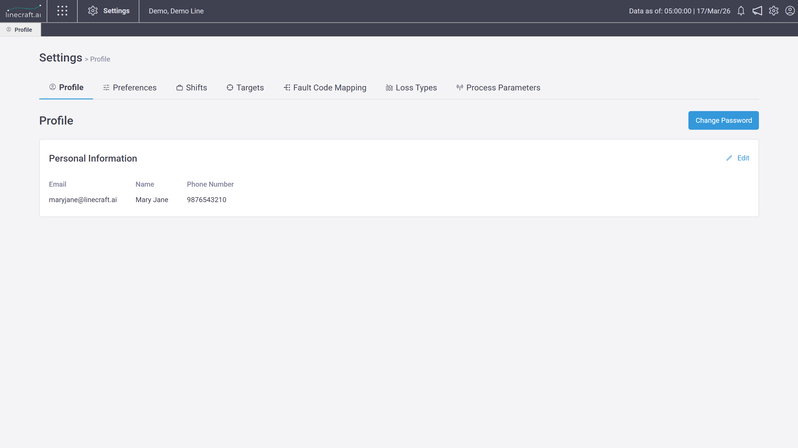

# 🔩 Settings

About <strong>Settings Module</strong> 

The **Settings** module allows users to configure system, operational, and personalization parameters required for effective use of the product.

From the Settings module, users can:

* Manage shifts and shift groups
* Configure production targets
* Update profile details and preferences
* Map fault codes to assets
* Configure loss types
* View and edit IoT and Quality parameters
* Sign out of the application

***

## `Profile`

The Profile section is where you keep your account information up to date. It opens by default whenever you land on Settings. Here, you can review your details, update your personal information, and change your password anytime.

<figure><figcaption></figcaption></figure>

### Edit Personal Information

<figure><figcaption></figcaption></figure>

Need to make a quick change? Just click Edit under Personal Information. You’ll be able to update your name and phone number, and your changes will reflect instantly once saved.

### Change Password

<figure><figcaption></figcaption></figure>

You can update your password directly from this tab. Once changed, it takes effect immediately across all your active sessions.

***

## `Preferences`

Preferences let you tailor how the system behaves for you. These settings are personal and  won’t affect anyone else.

### Time Preferences

Choose how time is displayed across the platform. You can switch between formats like standard view, seconds, or HH:MM:SS.\
\
Simply select your preferred option from the dropdown, and it will apply right away across the product.

<figure><figcaption></figcaption></figure>

<figure><figcaption></figcaption></figure>

***

## `Shifts`

The Shifts section helps you define how shift work hours are structured for production tracking and reporting.

### Default Shift Group

<figure><figcaption></figcaption></figure>

When you first visit, you’ll see a default shift group already set up during system configuration. If it’s the only one, it can’t be removed or changed as the default.

### Managing Shift Groups

<figure><figcaption></figcaption></figure>

You can:

* Rename a shift group
* Set a different one as default shift group
* Delete a shift group (only if more than one exists)

### Creating a Shift Group

Click **Add Shift Group** to create a new shift group.

<figure><figcaption></figcaption></figure>

You’ll be guided to:

* Enter a required name
* Add shifts (one is added by default)
* Define timings (starting and ending at 00:00 by default)

The Create button becomes active once all required details are filled.

### Adding Shifts and Breaks

You can easily build out your schedule by adding as many shifts as you need. Just click **Add Another Shift** to include more.

* While setting up shifts, make sure their timings don’t overlap. Once you have more than one shift, you’ll also see the option to remove any extra ones.
* Within each shift, you can add breaks to reflect downtime. Simply click **Add Break** inside a shift. Like shifts, break timings should not overlap, and you can add multiple breaks if needed.

### Viewing and Editing Shifts

<figure><figcaption></figcaption></figure>

Each shift is shown as an expandable section, so you can keep things organized.

Click on a shift to expand it and see more details. From there, you can:

* Update shift timings or details
* Delete the shift if needed
* Mark shift as off
* View and manage all associated breaks

This makes it easy to review and adjust your setup in one place without clutter.

***

## `Targets`

Targets allow you to define production expectations for different part types.

<figure><figcaption></figcaption></figure>

* Targets are configured part‑type wise
* Unit of measurement: **JPH (Jobs Per Hour)**

### Edit Target

<figure><figcaption></figcaption></figure>

You can set targets in Jobs Per Hour (JPH). If you update a target for a part type, the new value simply replaces the previous one effective immediately across the product.&#x20;

***

## `Fault Code Mapping`

This section helps you organize and standardize fault codes for each asset. **Fault codes** are standardized labels used to identify specific issues or failures in an asset.

<figure><figcaption></figcaption></figure>

### How Assets are Displayed under Asset Mapping

* Assets are listed alphabetically
* **Non‑mapped assets**:
  * Always appear at the top
  * Display an information (`i`) icon which indicating unmapped status on hover
* Tooltip at top shows the number of remaining unmapped assets
* Ignored assets will have “Ignored Asset” text below the asset name.

### Manage Asset Mapping&#x20;

Each asset has its own mapping sheet. Once mapped:

* A “Last Updated” timestamp is shown
* The asset moves below the unmapped list

You can:

* Download the current mapping or a standardized fault code mapping template.
* Upload updated mappings

### U**ploading Mappings**

You can upload mappings for:

* A single asset
* Multiple assets at once

Just make sure at least one asset is selected before uploading.

The system automatically checks your file for:

* Duplicates
* Missing values/ Empty fields
* Incorrect formats&#x20;

If something’s off, you’ll see clear error messages to help fix it.

### Zone Mapping

<figure><figcaption></figcaption></figure>

(The same experience applies to Zone Mappings.)

***

## `Loss Types`

Loss Types help categorize production losses consistently across the system.

<figure><figcaption></figcaption></figure>

### Default Loss Types

* You’ll find 16 preconfigured loss types to start with. You can update their names or descriptions, as long as each one remains unique.

<figure><figcaption></figcaption></figure>

### Creating a Loss Type

<figure><figcaption></figcaption></figure>

Click **Create Loss Type**, then add:

* A name
* A description

Once both are filled in, you can create the loss type right away.

Any changes you make will reflect across loss management analytics and reports, helping maintain consistent tracking and insights.

***

## `Process Parameters`

This section is available to users with the Configurator role and above and is used to manage IoT and Quality parameters.

<figure><figcaption></figcaption></figure>

### Viewing Parameter List&#x20;

Parameters are listed with the most recently updated ones at the top. Each entry shows key details like:

* Parameter Name
* Machine
* Part Type
* Min Value
* Max Value
* Target Value
* Unit
* Aggregator
* Parameter Type (IoT / Quality)

### Editing Parameters

<figure><figcaption></figcaption></figure>

Click the **Edit** icon to modify parameter values. You can update values such as.&#x20;

* Minimum, maximum, and target values (must be floating point numeric)
* Unit and aggregator (cannot be set to none)

All values must be valid and properly filled, errors are shown for invalid or missing data. Once saved, updates are applied immediately and reflected across the system.

